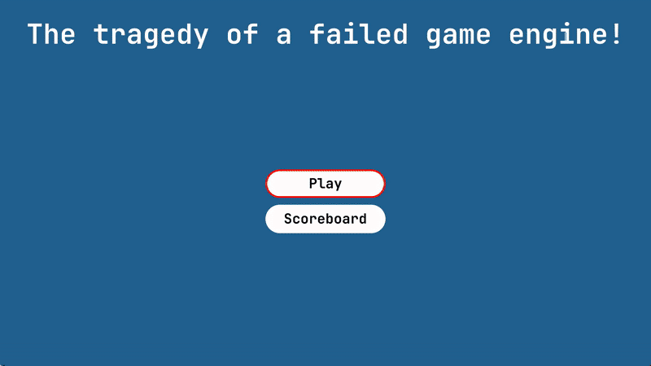

# Watermill Game Engine

**A modern C++ game engine featuring advanced Vulkan rendering, HTML/CSS UI integration, and comprehensive system architecture for 2D/3D game development.**



---

## 🎮 Features

- **Modern Vulkan Rendering** - Low-level GPU control with optimized pipelines
- **HTML/CSS UI Integration** - Web technologies for game UI via custom WebView renderer
- **Component-Based Architecture** - Flexible entity-component system
- **Multithreaded Job System** - Efficient parallel task execution
- **2D Physics Integration** - Built-in physics simulation (work in progress)
- **Asset Pipeline** - Support for GLTF models, textures, and shaders
- **Scene Management** - Hierarchical scene graph with transform system

---

## 📂 Project Structure

- `engine/` — Core engine systems (rendering, assets, entities, jobs, time)
- `executables/` — Game implementations (TimeShift platformer demo)
- `shared/` — Common rendering utilities and components
- `webview/` — HTML/CSS rendering integration with Vulkan
- `physics_2d/` — 2D physics system (in development)
- `gizmos/` — Debug visualization tools (in development)
- `assets/` — Shaders, textures, models, and game resources
- `docs/` — [Comprehensive documentation](docs/README.md)

---

## 🛠️ Build Instructions

First, ensure you have installed the Vulkan SDK and CMake (version 3.10+).

1. Clone the repository with submodules:
   ```bash
   git clone --recurse-submodules https://github.com/MohammadFakhreddin/Watermill.git

2. Create a build directory:
   ```bash
   mkdir build
   cd build
3. Configure the project with CMake:
   ```bash
   cmake ..
4. Build the project:
   ```bash
   cmake --build .

---

## 🚀 Quick Start

After building, run the TimeShift demo game:

```bash
# From build directory
./executables/time_shift/TimeShift
```

Controls:
- **Arrow Keys/Gamepad** - Movement
- **Space/Button A** - Jump/Action
- **F1** - Debug menu
- **F5** - Reload shaders

---

## 📖 Documentation

- [Architecture Overview](docs/ARCHITECTURE.md) - System design and patterns
- [Engine Systems](docs/ENGINE_SYSTEMS.md) - Core engine components
- [TimeShift Game](docs/TIMESHIFT_GAME.md) - Demo game documentation
- [WebView Integration](docs/WEBVIEW_INTEGRATION.md) - HTML/CSS rendering
- [API Reference](docs/API_REFERENCE.md) - Key classes and interfaces

---

## 🛠️ Technology Stack

- **C++17** - Core language
- **Vulkan** - Graphics API
- **SDL2** - Window management and input
- **GLM** - Mathematics library
- **ImGui** - Debug UI
- **LiteHTML** - HTML/CSS parsing
- **JSON** - Configuration and levels
- **CMake** - Build system

---

## 📝 License

This project is for educational and practice purposes, focusing on shader programming and visual effects.